# Hero Talents & Abilities

> Talent? Hah. That seems generous.
>
> --Raven Lord

<a href="#heroes" class="btn-heroes">Jump to Heroes</a>

Example:

```javascript
{
  "id": "68",
  "shortName": "malthael",
  "attributeId": "MALT",
  "name": "Malthael",
  "icon": "malthael.png",
  "role": "Assassin",
  "type": "Melee",
  "releaseDate": "2017-06-13",
  "abilities": {
    "Malthael": [
      {
        "name": "Soul Rip",
        "description": "Extract the souls of nearby enemies afflicted by Reaper's Mark, dealing 100 (+4% per level) damage and healing Malthael for 25 (+4% per level) per target hit. Heroic targets heal Malthael for an additional 4% of the Hero's maximum Health.",
        "hotkey": "Q",
        "abilityId": "Malthael|Q1",
        "cooldown": 2,
        "manaCost": 25,
        "icon": "storm_ui_icon_malthael_soulrip.png",
        "type": "basic"
      },
      ...
      {
        "name": "Tormented Souls",
        "description": "Unleash a torrent of souls, continually applying Reaper's Mark to nearby enemies for 4 seconds.",
        "hotkey": "R",
        "abilityId": "Malthael|R1",
        "cooldown": 80,
        "manaCost": 100,
        "icon": "storm_ui_icon_malthael_tormentedsoul.png",
        "type": "heroic"
      },
      ...
      {
        "name": "Reaper's Mark",
        "description": "Basic Attacks cleave in an area in front of Malthael and afflict non-Structure targets with Reaper's Mark for 4 seconds.  Marked enemies are revealed and take damage equal to 1.75% of their maximum Health every 1 second.",
        "trait": true,
        "abilityId": "Malthael|D1",
        "icon": "storm_ui_icon_malthael_reapersmark.png",
        "type": "trait"
      }
    ]
  },
  "talents": {
    "1": [
      {
        "tooltipId": "MalthaelDeathsReach",
        "talentTreeId": "MalthaelDeathsReach",
        "name": "Death's Reach",
        "description": "Increase Wraith Strike's range by 35%.",
        "icon": "storm_ui_icon_malthael_wraithstrike.png",
        "type": "W",
        "sort": 1,
        "abilityId": "Malthael|W1",
        "abilityLinks": [
          "Malthael|W1"
        ]
      },
      {
        "tooltipId": "MalthaelOnAPaleHorse",
        "talentTreeId": "MalthaelOnAPaleHorse",
        "name": "On a Pale Horse",
        "description": "Gain an additional 20% Movement Speed while mounted.",
        "icon": "storm_ui_icon_malthael_onpalehorse.png",
        "type": "Passive",
        "sort": 2,
        "abilityId": "_stormhero|Z1",
        "abilityLinks": [
          "_stormhero|Z1"
        ]
      },
      {
        "tooltipId": "MalthaelFearTheReaper",
        "talentTreeId": "MalthaelFearTheReaper",
        "name": "Fear the Reaper",
        "description": "Activate to increase Movement Speed by 25% and pass through other units for 4 seconds.",
        "icon": "storm_ui_icon_malthael_fearthereaper.png",
        "type": "Active",
        "sort": 3,
        "cooldown": 25,
        "abilityId": "Malthael|Active"
      }
    ],
    "4": [
    ...
    ]
    ...
}
```

### Notes on key/value pairs

* `shortName` is the hero's name with periods, dashes, apostrophes, spaces, and capitalization removed; it is currently used as the name of a hero's JSON file and image
* `manaCost` is a string due to several Heroes (Azmodan, Arthas, etc.) having channeled abilities with per-second mana costs
* `abilityId` can be used to link a talent to its related ability.
    * Talents that create a new ability will have `abilityId` of `HeroName|Active`.  Ex: Fear the Reaper (seen above), Bolt of the Storm
    * Talents granting changes to Basic Attacks or other passive effects will have `abilityId` of `HeroName|Passive`.  Ex: On a Pale Horse (above), Burning Rage, Executioner
* `talentTreeId` is the name of the talent as used in replay files
* `sort` indicates the order of talents on that level/tier
* `icon` is the image name for the talent from game files

### Game data

* **heroes/** and **images/** contain curated versions of the game data and icons, prepared by [heroes-convert](https://github.com/tattersoftware/heroes-convert)
* Unprocessed versions of the parsed game data is hosted at [heroes-data](https://github.com/HeroesToolChest/heroes-data)
* Uncompressed versions of the icons are hosted at [heroes-images](https://github.com/HeroesToolChest/heroes-images)
* Game data extractions for both of the repos above are acquired using koliva8245's [HeroesDataParser](https://github.com/HeroesToolChest/HeroesDataParser)

See the [Contributing docs](CONTRIBUTING.md) for more information on our process.

### Projects using heroes-talents

* [HeroesPatchNotes.com](https://heroespatchnotes.com)
* [HeroesInfoBot](https://www.reddit.com/r/heroesofthestorm/comments/6zwyfw/heroesinfobot_abilities_talent_tiers_cooldowns/) on reddit's [/r/heroesofthestorm](https://www.reddit.com/r/heroesofthestorm/)
* [HotsApi](http://hotsapi.net/docs)
* [Hots-Info-Bot](https://discordbots.org/bot/407735948667912214) discord chatbot

### Want to use this in your Node.js project?

`npm install --save git+https://git@github.com/heroespatchnotes/heroes-talents.git`

**heroes-talents** includes basic support for loading hero data into your project. See
[dist/test.js](dist/test.js) for an example, or [dist/index.js](dist/index.js) for the source.

```javascript
const HeroesTalents = require('heroes-talents')

async function test() {
  try {
    const heroes = await HeroesTalents.loadHeroJSONFiles()
    const favoriteHero = heroes.alarak
    console.log(`My favorite hero is ${favoriteHero.name}. He is an ${favoriteHero.role}.`)
  } catch(err) {
    console.log(err)
  }
}
```

## Heroes

<a class="img-wrap" href="hero/abathur.json">
  
  <span>Abathur</span>
</a>
<a class="img-wrap" href="hero/alarak.json">
  
  <span>Alarak</span>
</a>
<a class="img-wrap" href="hero/alexstrasza.json">
  
  <span>Alexstrasza</span>
</a>
<a class="img-wrap" href="hero/ana.json">
  
  <span>Ana</span>
</a>
<a class="img-wrap" href="hero/anduin.json">
  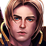
  <span>Anduin</span>
</a>
<a class="img-wrap" href="hero/anubarak.json">
  
  <span>Anub'arak</span>
</a>
<a class="img-wrap" href="hero/artanis.json">
  
  <span>Artanis</span>
</a>
<a class="img-wrap" href="hero/arthas.json">
  
  <span>Arthas</span>
</a>
<a class="img-wrap" href="hero/auriel.json">
  
  <span>Auriel</span>
</a>
<a class="img-wrap" href="hero/azmodan.json">
  
  <span>Azmodan</span>
</a>
<a class="img-wrap" href="hero/blaze.json">
  
  <span>Blaze</span>
</a>
<a class="img-wrap" href="hero/brightwing.json">
  
  <span>Brightwing</span>
</a>
<a class="img-wrap" href="hero/thebutcher.json">
  
  <span>The Butcher</span>
</a>
<a class="img-wrap" href="hero/cassia.json">
  
  <span>Cassia</span>
</a>
<a class="img-wrap" href="hero/chen.json">
  
  <span>Chen</span>
</a>
<a class="img-wrap" href="hero/chogall.json">
  
  <span>Cho</span>
</a>
<a class="img-wrap" href="hero/chromie.json">
  
  <span>Chromie</span>
</a>
<a class="img-wrap" href="hero/deathwing.json">
  
  <span>Deathwing</span>
</a>
<a class="img-wrap" href="hero/deckard.json">
  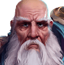
  <span>Deckard</span>
</a>
<a class="img-wrap" href="hero/dehaka.json">
  
  <span>Dehaka</span>
</a>
<a class="img-wrap" href="hero/diablo.json">
  
  <span>Diablo</span>
</a>
<a class="img-wrap" href="hero/dva.json">
  
  <span>D.Va</span>
</a>
<a class="img-wrap" href="hero/etc.json">
  
  <span>E.T.C.</span>
</a>
<a class="img-wrap" href="hero/falstad.json">
  
  <span>Falstad</span>
</a>
<a class="img-wrap" href="hero/fenix.json">
  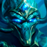
  <span>Fenix</span>
</a>
<a class="img-wrap" href="hero/gall.json">
  
  <span>Gall</span>
</a>
<a class="img-wrap" href="hero/garrosh.json">
  
  <span>Garrosh</span>
</a>
<a class="img-wrap" href="hero/gazlowe.json">
  
  <span>Gazlowe</span>
</a>
<a class="img-wrap" href="hero/genji.json">
  
  <span>Genji</span>
</a>
<a class="img-wrap" href="hero/greymane.json">
  
  <span>Greymane</span>
</a>
<a class="img-wrap" href="hero/guldan.json">
  
  <span>Gul'dan</span>
</a>
<a class="img-wrap" href="hero/hanzo.json">
  
  <span>Hanzo</span>
</a>
<a class="img-wrap" href="hero/illidan.json">
  
  <span>Illidan</span>
</a>
<a class="img-wrap" href="hero/imperius.json">
  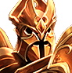
  <span>Imperius</span>
</a>
<a class="img-wrap" href="hero/jaina.json">
  
  <span>Jaina</span>
</a>
<a class="img-wrap" href="hero/johanna.json">
  
  <span>Johanna</span>
</a>
<a class="img-wrap" href="hero/junkrat.json">
  
  <span>Junkrat</span>
</a>
<a class="img-wrap" href="hero/kaelthas.json">
  
  <span>Kael'thas</span>
</a>
<a class="img-wrap" href="hero/kelthuzad.json">
  
  <span>Kel'Thuzad</span>
</a>
<a class="img-wrap" href="hero/kerrigan.json">
  
  <span>Kerrigan</span>
</a>
<a class="img-wrap" href="hero/kharazim.json">
  
  <span>Kharazim</span>
</a>
<a class="img-wrap" href="hero/leoric.json">
  
  <span>Leoric</span>
</a>
<a class="img-wrap" href="hero/lili.json">
  
  <span>Li Li</span>
</a>
<a class="img-wrap" href="hero/liming.json">
  
  <span>Li-Ming</span>
</a>
<a class="img-wrap" href="hero/lostvikings.json">
  
  <span>The Lost Vikings</span>
</a>
<a class="img-wrap" href="hero/ltmorales.json">
  
  <span>Lt. Morales</span>
</a>
<a class="img-wrap" href="hero/lucio.json">
  
  <span>Lúcio</span>
</a>
<a class="img-wrap" href="hero/lunara.json">
  
  <span>Lunara</span>
</a>
<a class="img-wrap" href="hero/maiev.json">
  
  <span>Maiev</span>
</a>
<a class="img-wrap" href="hero/malfurion.json">
  
  <span>Malfurion</span>
</a>
<a class="img-wrap" href="hero/malganis.json">
  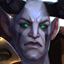
  <span>Mal'Ganis</span>
</a>
<a class="img-wrap" href="hero/malthael.json">
  
  <span>Malthael</span>
</a>
<a class="img-wrap" href="hero/medivh.json">
  
  <span>Medivh</span>
</a>
<a class="img-wrap" href="hero/mei.json">
  
  <span>Mei</span>
</a>
<a class="img-wrap" href="hero/mephisto.json">
  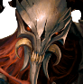
  <span>Mephisto</span>
</a>
<a class="img-wrap" href="hero/muradin.json">
  
  <span>Muradin</span>
</a>
<a class="img-wrap" href="hero/murky.json">
  
  <span>Murky</span>
</a>
<a class="img-wrap" href="hero/nazeebo.json">
  
  <span>Nazeebo</span>
</a>
<a class="img-wrap" href="hero/nova.json">
  
  <span>Nova</span>
</a>
<a class="img-wrap" href="hero/orphea.json">
  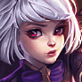
  <span>Orphea</span>
</a>
<a class="img-wrap" href="hero/probius.json">
  
  <span>Probius</span>
</a>
<a class="img-wrap" href="hero/qhira.json">
  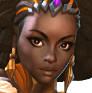
  <span>Qhira</span>
</a>
<a class="img-wrap" href="hero/ragnaros.json">
  
  <span>Ragnaros</span>
</a>
<a class="img-wrap" href="hero/raynor.json">
  
  <span>Raynor</span>
</a>
<a class="img-wrap" href="hero/rehgar.json">
  
  <span>Rehgar</span>
</a>
<a class="img-wrap" href="hero/rexxar.json">
  
  <span>Rexxar</span>
</a>
<a class="img-wrap" href="hero/samuro.json">
  
  <span>Samuro</span>
</a>
<a class="img-wrap" href="hero/sgthammer.json">
  
  <span>Sgt. Hammer</span>
</a>
<a class="img-wrap" href="hero/sonya.json">
  
  <span>Sonya</span>
</a>
<a class="img-wrap" href="hero/stitches.json">
  
  <span>Stitches</span>
</a>
<a class="img-wrap" href="hero/stukov.json">
  
  <span>Stukov</span>
</a>
<a class="img-wrap" href="hero/sylvanas.json">
  
  <span>Sylvanas</span>
</a>
<a class="img-wrap" href="hero/tassadar.json">
  
  <span>Tassadar</span>
</a>
<a class="img-wrap" href="hero/thrall.json">
  
  <span>Thrall</span>
</a>
<a class="img-wrap" href="hero/tracer.json">
  
  <span>Tracer</span>
</a>
<a class="img-wrap" href="hero/tychus.json">
  
  <span>Tychus</span>
</a>
<a class="img-wrap" href="hero/tyrael.json">
  
  <span>Tyrael</span>
</a>
<a class="img-wrap" href="hero/tyrande.json">
  
  <span>Tyrande</span>
</a>
<a class="img-wrap" href="hero/uther.json">
  
  <span>Uther</span>
</a>
<a class="img-wrap" href="hero/valeera.json">
  
  <span>Valeera</span>
</a>
<a class="img-wrap" href="hero/valla.json">
  
  <span>Valla</span>
</a>
<a class="img-wrap" href="hero/varian.json">
  
  <span>Varian</span>
</a>
<a class="img-wrap" href="hero/whitemane.json">
  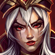
  <span>Whitemane</span>
</a>
<a class="img-wrap" href="hero/xul.json">
  
  <span>Xul</span>
</a>
<a class="img-wrap" href="hero/yrel.json">
  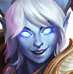
  <span>Yrel</span>
</a>
<a class="img-wrap" href="hero/zagara.json">
  
  <span>Zagara</span>
</a>
<a class="img-wrap" href="hero/zarya.json">
  
  <span>Zarya</span>
</a>
<a class="img-wrap" href="hero/zeratul.json">
  
  <span>Zeratul</span>
</a>
<a class="img-wrap" href="hero/zuljin.json">
  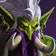
  <span>Zul'jin</span>
</a>
